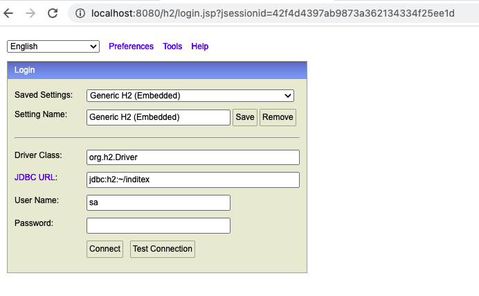
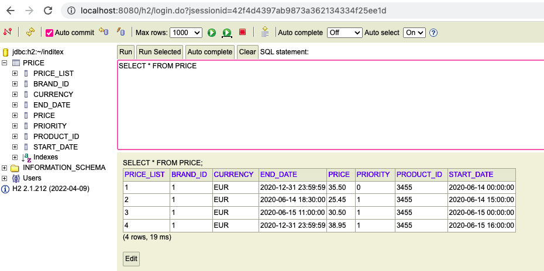
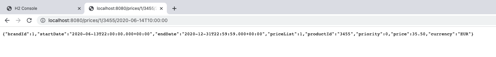
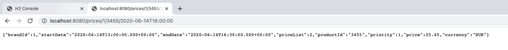
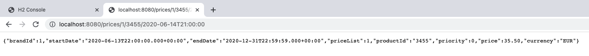
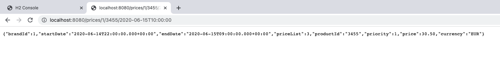
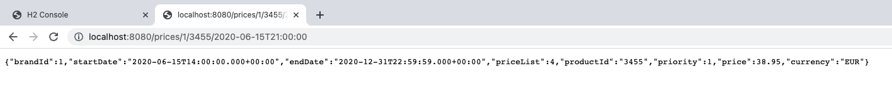
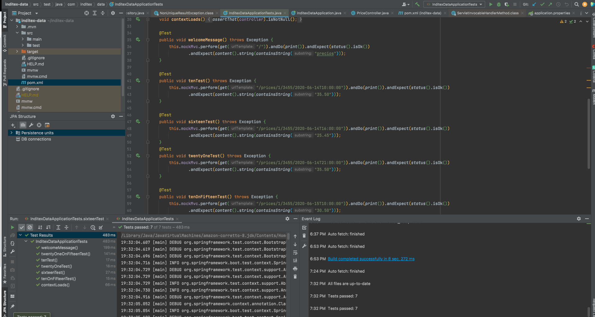

## Prueba de Inditex

Este repositorio contiene la respuesta a la prueba de Java de Inditex que se coloca en el enunciado

### Enunciado

n la base de datos de comercio electrónico de la compañía disponemos de la tabla PRICES que refleja el precio final (pvp) y la tarifa que aplica a un producto de una cadena entre unas fechas determinadas. A continuación se muestra un ejemplo de la tabla con los campos relevantes:
 
PRICES
-------
 
BRAND_ID         START_DATE                                    END_DATE                        PRICE_LIST                   PRODUCT_ID  PRIORITY                 PRICE           CURR
------------------------------------------------------------------------------------------------------------------------------------------------------------------------------------------------------------------------------------------
1         2020-06-14-00.00.00                        2020-12-31-23.59.59                        1                        35455                0                        35.50            EUR
1         2020-06-14-15.00.00                        2020-06-14-18.30.00                        2                        35455                1                        25.45            EUR
1         2020-06-15-00.00.00                        2020-06-15-11.00.00                        3                        35455                1                        30.50            EUR
1         2020-06-15-16.00.00                        2020-12-31-23.59.59                        4                        35455                1                        38.95            EUR
 
Campos: 
 
BRAND_ID: foreign key de la cadena del grupo (1 = ZARA).
START_DATE , END_DATE: rango de fechas en el que aplica el precio tarifa indicado.
PRICE_LIST: Identificador de la tarifa de precios aplicable.
PRODUCT_ID: Identificador código de producto.
PRIORITY: Desambiguador de aplicación de precios. Si dos tarifas coinciden en un rago de fechas se aplica la de mayor prioridad (mayor valor numérico).
PRICE: precio final de venta.
CURR: iso de la moneda.
 
Se pide:
 
Construir una aplicación/servicio en SpringBoot que provea una end point rest de consulta  tal que:
 
Acepte como parámetros de entrada: fecha de aplicación, identificador de producto, identificador de cadena.
Devuelva como datos de salida: identificador de producto, identificador de cadena, tarifa a aplicar, fechas de aplicación y precio final a aplicar.
 
Se debe utilizar una base de datos en memoria (tipo h2) e inicializar con los datos del ejemplo, (se pueden cambiar el nombre de los campos y añadir otros nuevos si se quiere, elegir el tipo de dato que se considere adecuado para los mismos).
              
Desarrollar unos test al endpoint rest que  validen las siguientes peticiones al servicio con los datos del ejemplo:
                                                                                       
-          Test 1: petición a las 10:00 del día 14 del producto 35455   para la brand 1 (ZARA)
-          Test 2: petición a las 16:00 del día 14 del producto 35455   para la brand 1 (ZARA)
-          Test 3: petición a las 21:00 del día 14 del producto 35455   para la brand 1 (ZARA)
-          Test 4: petición a las 10:00 del día 15 del producto 35455   para la brand 1 (ZARA)
-          Test 5: petición a las 21:00 del día 16 del producto 35455   para la brand 1 (ZARA)
 
 
Se valorará:
 
Diseño y construcción del servicio.
Calidad de Código.
Resultados correctos en los test.

## Aclaraciones

Para solucionar el problema se ha creado un servicio que tiene las librerías de JPA, H2 y Starter Web de Spring Boot. Dado que sólo se requiere la creación de un endpoint que traiga los datos requeridos.

## Consideraciones

1. En los datos del ejemplo se ha cambiado la llave primaria de la tabla, ya que no puede ser que la llave primaria tenga datos repetidos. Dado que el campo Price_list tiene valores diferentes para cada registro, se ha colocado éste como llave primaria.
2. El parámetro queryDate sería la fecha parámetro para saber qué precio debe cobrarse en un momento dado.
3. La tabla creada en H2 es la siguiente:
 
 
 
4. La URL del servicio se construye así /prices/{brandId}/{productId}/{queryDate}. 
5. La respuesta del servicio es una cadena en formato json con cada uno de los atributos de la tabla Price correspondiente con los datos suministrados. 
6. Ninguno de los parámetros es opcional.
7. Adicionalmene se proporcionan respuestas para el path / y para /prices, éste último devuelve todos los registros de la tabla Price.

## Solución
 Se ha probado el servicio a través del llamado web en la URL con los parámetros indicados (brandId, productId, queryDate(fecha de aplicación):
 
 
 
 
 
 
 
 También se han hecho pruebas automatizadas, como se requiere en el enunciado:
 
  
  
  El paquete en el que se encuentra el código es com.inditex.data, siguiendo la estructura de Maven.
  
 

